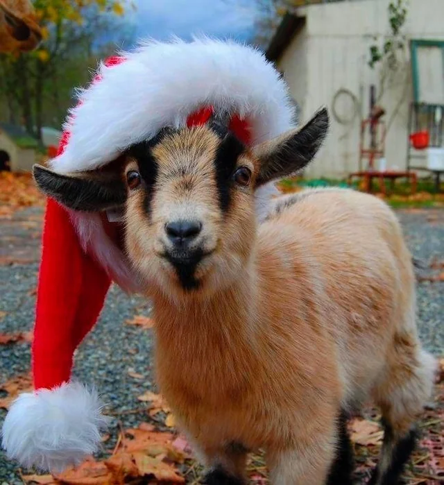

# Contact GoataClause!

Come get licked by your favorite yule-goat!

The goat or domestic goat (Capra hircus) is a species of goat-antelope that is mostly kept as livestock. It was domesticated from the wild goat (C. aegagrus) of Southwest Asia and Eastern Europe. The goat is a member of the family Bovidae, meaning it is closely related to the sheep. It was one of the first animals to be domesticated, in Iran around 10,000 years ago.

Goats have been used for milk, meat, wool, and skins across much of the world. Milk from goats is often turned into cheese. In 2022, there were more than 1,100 million goats living in the world, of which 150 million were in India.

Goats feature in mythology, folklore, and religion in many parts of the world, including in the classical myth of Amalthea, in the goats that pulled the chariot of the Norse god Thor, in the [Scandinavian Yule goat](https://en.wikipedia.org/wiki/Yule_goat "Yule goat page on Wikipedia"), and in Hinduism's goat-headed Daksha. In Christianity and Satanism, the devil is sometimes depicted as a goat.

[Source of Goaty Goodness](https://en.wikipedia.org/wiki/Goat "Goat page on Wikipedia")

----

This is a new section of content! You can tell because of the four dashes in the markdown!
