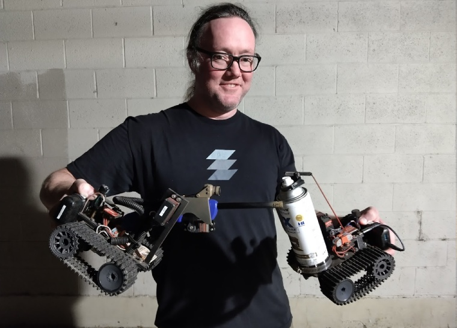

# What is *801 Labs*?

801 Labs is a *Salt Lake City* based hackerspace created by local information technology, electronics, and information security enthusiasts. 801 Labs is a physical space designed to be a center for peer learning and knowledge sharing in the form of workshops, presentations, and lectures. We also offer regular activities to the community, where people can gather to work on their own projects, exchange ideas, and learn from each other. Since 801 Labs is intended to be a shared community resource, almost all of our events are free and open to the public.

----

## Sodar shares his robots, Cindy and Torchy
##### set_parking_lot_on_fire.sh

----

## What will I learn at 801 Labs?

801 Labs runs a wide variety of classes that cover topics ranging from designing and building electronics, to information security, to programming, to 3D printing and 3D modeling, and more. Since we are a community run organization, our class offerings are based on what members of the local community are proficient in and willing to teach. The best way to find out exactly what you can learn is to check out our upcoming events. If you’ve got something you want to teach or would like to learn about, you can check out the get involved section and let us know you’d like to teach a class, or to let us know there is interest in a topic so that we can try to organize a class to cover that topic.

----

## Upcoming Events

<iframe src="https://calendar.google.com/calendar/embed?height=600&wkst=1&ctz=America%2FDenver&showPrint=0&src=Y190a2Q1NjhrcGZtZmRudXM5ZnJ2c3Y1ZmZzMEBncm91cC5jYWxlbmRhci5nb29nbGUuY29t&color=%2333b679" style="filter: invert(1) hue-rotate(240deg); border: none; width: 100%; margin: 0 auto;" height="600" frameborder="0" scrolling="no"></iframe>

