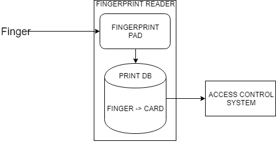
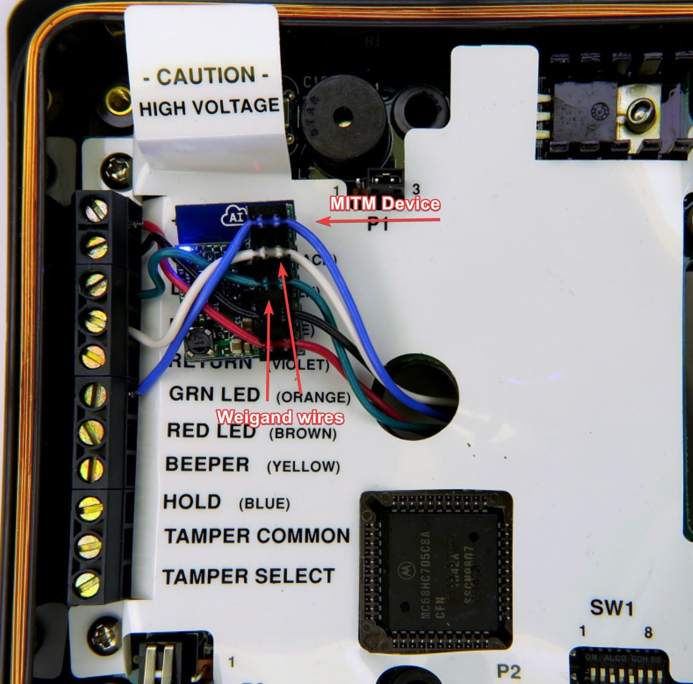

### Fingerprint readers are silly

DISCLAIMER: I used to work for a physical security company architecting access
control and surveillance solutions.

One job I was tasked with was getting a fingerprint-based reader tested and
operational for demoing our new level of hardware support for more secure
facilities, 2 factor physical access control; something you are (fingerprint)
and something you know or have. (pin/card)

We were given these readers to test. The readers had a TON of wiring on the back
of them. The two important things that the reader pinouts contained was

1. Weigand 2-pair access control wire
2. POE-enabled RJ45 port

The way that these readers work with existing access control systems
**completely invalidates** the security benefits of using a fingerprint-based
authentication system. Let me explain the architecture and design of this
system.

First, you must enrol fingerprints on the reader. You essentially scan a
fingerprint a handful of times, give it a name, and assign it a badge. Wait, a
badge? Yes. The reader contains a **local** database of every fingerprint in
it's system, as well as a **card **associated to this fingerprint. When a
fingerprint authenticates and is validated to the local database on the reader,
the reader takes the card associated with that fingerprint and relays it over
Wiegand wiring to an access control box. This reader is essentially functioning
the exact same as a normal fingerprint-less card reader.

The fingerprint reader on the back end/access control provides the exact same
level of authentication as a standard card-based system. If the reader is
configured to pass through card reads (passthrough mode for 2nd factor, or for
card or fingerprint setups) the fingerprints are **completely useless**.

---

# Potential attack 1: network permeter comprimise

This edge device has an ethernet port.

Which means it has an ethernet cable, which is going to have to tie into an
internal access control network to allow it to talk to the provisioning server.
Most people put their ICS on the same network. Cameras, access controls, gate
controls, HVAC, etc. From the exterior of the building, you now have hardline
access to an internal control network.

If this network has any kind of network security (for instance, MAC address
filtering), you can pull the MAC of the fingerprint reader directly from a
sticker located next to the ethernet port. Spoof that MAC and you have access.

---

# Potential attack 2: device fingerprint datastore compromise

The database containing **fingerprint** data is stored non-centrally, and every
reader has a copy. The enrolment process is

1. Scan fingerprint on central server
2. Associate card, name, etc to fingerprint
3. Push new user profile to all readers on the network
4. Reader receives profile, adds it to internal datastore

If you compromise the edge device (reader), you can potentially access this
database through their control software, or directly through chip-off forensics.
This datastore is going to not just contain fingerprint data, of which I would
consider **incredibly valuable and sensitive information**, it would also
contain all associated cards for every user profile.

Unless a mass card revocation is initiated, you now also have a datastore of
every functioning, authenticating, door-opening card in the system.
Additionally, you may have full names, positions, teams, pictures, etc for every
user.

---

# Potential attack 3: Weigand man-in-the-middle

This isn't specifically a fingerprint reader specific attack, but it is just as
effective. You can purchase a device that clamps onto the Weigand data wires and
can Man-in-the-middle cards over the wire. With this, you can

- offload all cards as they get sent to the access control system
- in-line replace/denial of service on all/selected cards (lock someone out of
  the building)
- Replay a functioning card without having to have a card cloner/spoofer

Devices like the [ESPKey](https://redteamtools.com/espkey) are cheap ($99) and
usable with bluetooth or wifi.

