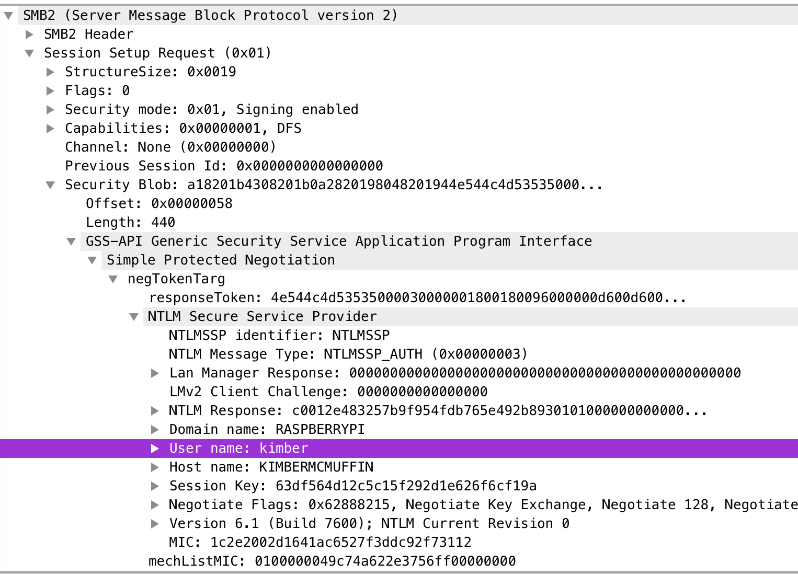
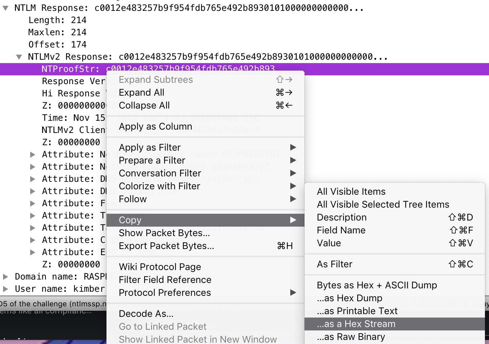
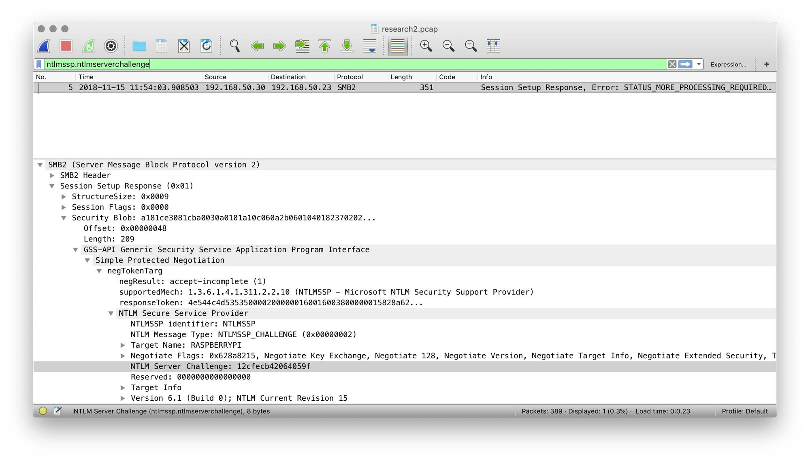

1. Open your .pcap that contains an NTLMv2 hash in Wireshark.
2. Filter by ntlmssp to get the authentication handshake.

3. In this case, we get three packets. Find the NTLMSSP_AUTH packet. Filter the
   packet down to the Security Blob layer to get to the juicy good stuff:

4. Copy out the domain name and user name to a text document.

5. Drill down into the NTLM Response section to find NTProofStr and NTLMv2
   response. Copy both of these out to the text document as a Hex String.

6. Notice that NTLMv2Response begins with the ntlmProofStr, so delete the
   ntlmProofStr from the NTLMv2Response.

7. Enter ntlmssp.ntlmserverchallenge into the search filter. This will highlight
   the packet where the NTLM Server Challenge is found, generally the packet
   before the NTLM_Auth packet. Copy this value to the text document as a Hex
   String.

8. Put the values into the following format and save it as crackme.txt:

username::domain:ServerChallenge:NTproofstring:modifiedntlmv2response

9. Find your favorite password list (RockYou? best_1000_passwords2018.txt?) and
   open a terminal to use hashcat to run:

> hashcat -m 5600 crackme.txt passwordlist.txt

and it will give you the user's password!

sources for more information:

- [https://www.root9b.com/newsroom/attacking-windows-fallback-authentication/](https://www.root9b.com/newsroom/attacking-windows-fallback-authentication/)
- [https://foxglovesecurity.com/2016/09/26/rotten-potato-privilege-escalation-from-service-accounts-to-system/](https://foxglovesecurity.com/2016/09/26/rotten-potato-privilege-escalation-from-service-accounts-to-system/)
