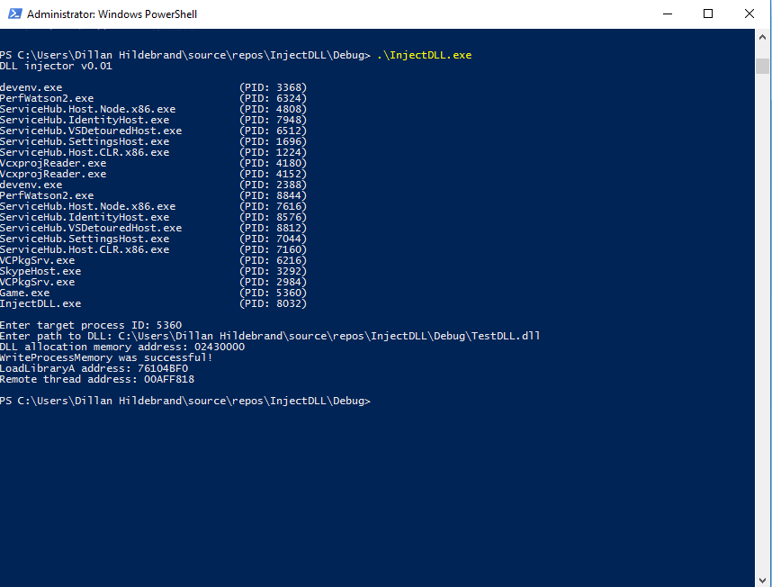
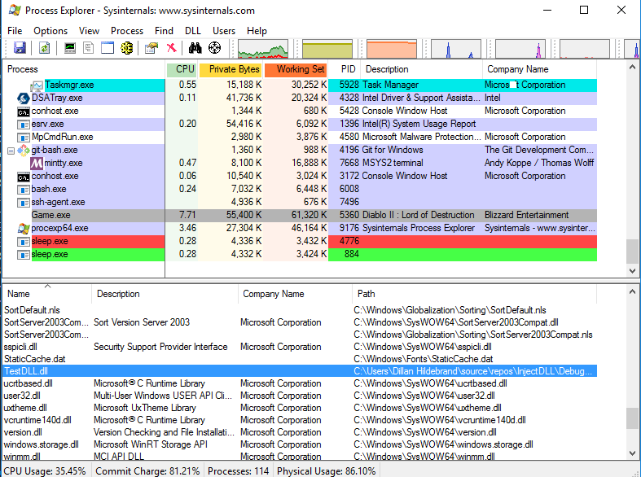

[DLL injection](https://en.wikipedia.org/wiki/DLL_injection) is the process of
forcing a running process to load a DLL (Dynamically Linked Library) of your
choice. In this write-up, I'll walk you through the LoadLibraryA injection
method. This causes the DLL to be loaded into the context of the process thus
allowing us to execute our own code inside of the process's virtual memory
space.

    I assume there is a base understanding of what a DLL is. By the end of this write-up, we'll have a functional DLL injector along with a bare-bone test DLL which we'll use for testing during development.

    Writing a DLL injector is pretty trivial and only requires a handful steps. Remember that DLLs are specific to Windows and there-for we'll be utilizing functions provided to us by the Windows API. The steps required for the task at hand are in order as follows:

1. Acquire a handle to the remote process that you want to inject / load your
   DLL into. We do this by prompting for a process ID (PID) after displaying a
   list of processes w/ their PIDs.

   // Get the remote target pid uint16_t target_pid = get_target_pid();

   if (!target_pid) { std::cerr << "Getting remote target process ID failed..."
   << std::endl; return 1; }

   // <snipped> ...

   // Obtain a handle to the target remote process. HANDLE target_process =
   OpenProcess(PROCESS_ALL_ACCESS, FALSE, target_pid);

   if (target_process == NULL) { std::cerr << "Acquiring a handle to the remote
   target process failed..." << std::endl; return -1; }

_get_target_pid() function:_

    uint16_t get_target_pid() {
    	uint16_t pid = 0;
    	
    	std::string pid_str;
    	bool first_input_entered = false;

    	do {
    		if (first_input_entered) {
    			system("cls");
    			print_banner();
    			std::cerr << "The given process ID is invalid, try again..." << std::endl;
    		}

    		print_process_list();

    		std::cout << "\nEnter target process ID: ";
    		std::getline(std::cin, pid_str);

    		if (first_input_entered == false) {
    			first_input_entered = true;
    		}

    		if (pid_str == "exit" ||
    			pid_str == "quit") {
    			break;
    		}

    	} while (file_exists(pid_str) == false && !pid_str.size());

    	if (pid_str != "exit" &&
    		pid_str != "quit") {
    		pid = (uint16_t)std::stoi(pid_str);
    	}

    	return pid;
    }

2. Create and store the DLL's absolute path in a variable.

   // Get the dll's path that we want to inject into our remote target process.
   std::string dll_path = get_dll_path();

   std::cout << "DLL path: " << dll_path << std::endl;

_get_dll_path() function:_

    std::string get_dll_path() {

    	std::string dll_path;
    	bool first_input_entered = false;

    	do {
    		if (first_input_entered) {
    			system("cls");
    			print_banner();
    			std::cerr << "Specified DLL path was invalid, try again..." << std::endl;
    		}

    		std::cout << "Enter path to DLL: ";
    		std::getline(std::cin, dll_path);

    		if (first_input_entered == false) {
    			first_input_entered = true;
    		}

    		if (dll_path == "exit" ||
    			dll_path == "quit") {
    			break;
    		}

    	} while (file_exists(dll_path) == false);

    	return dll_path;
    }

3. Now we need to allocate enough space in the remote process to store the DLLs
   absolute path. We achieve this by using Window's
   [VirtualAllocEx](https://docs.microsoft.com/en-us/windows/desktop/api/memoryapi/nf-memoryapi-virtualallocex)
   function.

   // Allocate space for our DLL path inside the target remote process. LPVOID
   dll_path_in_remote_mem_addr = VirtualAllocEx( target_process, NULL,
   _MAX_PATH, MEM_RESERVE | MEM_COMMIT, PAGE_EXECUTE_READWRITE );

   if (dll_path_in_remote_mem_addr == NULL) { std::cerr << "Allocating space for
   our DLL path in the remote target process's virtual memory space failed..."
   << std::endl; CloseHandle(target_process); return 1; }

   std::cout << "DLL allocation memory address: " <<
   &dll_path_in_remote_mem_addr << std::endl;

4. And now that we've allocated and reserved enough memory for the DLL path, we
   can write it into that region of memory of the remote process using the
   Window's
   [WriteProcessMemory](https://docs.microsoft.com/en-us/windows/desktop/api/memoryapi/nf-memoryapi-writeprocessmemory)
   function.

   // Copy the DLL path into the allocated memory region. bool write_status =
   WriteProcessMemory( target_process, dll_path_in_remote_mem_addr,
   dll_path.c_str(), strlen(dll_path.c_str()), NULL );

   std::cout << "WriteProcessMemory was " << (write_status ? "successful!" :
   "unsuccessful...") << std::endl;;

   if (!write_status) { std::cerr << "GetLastError() for failed
   WriteProcessMemory() call: " << GetLastError() << std::endl;
   CloseHandle(target_process); return 1; }

5. Next, we'll need to obtain the address to the Window's
   [LoadLibraryA](https://docs.microsoft.com/en-us/windows/desktop/api/libloaderapi/nf-libloaderapi-loadlibrarya)
   function. This is easily done through the Window's
   [GetProcAddress](https://docs.microsoft.com/en-us/windows/desktop/api/libloaderapi/nf-libloaderapi-getprocaddress)
   function.

   // Get the address to the LoadLibraryA Windows API function. LPVOID
   load_library_addr = (LPVOID)GetProcAddress( GetModuleHandle("kernel32.dll"),
   "LoadLibraryA" );

   if (load_library_addr == NULL) { std::cerr << "GetProcAddress failed..." <<
   std::endl; CloseHandle(target_process); return 1; }

   std::cout << "LoadLibraryA address: " << &load_library_addr << std::endl;

6. Create a remote thread via
   [CreateRemoteThread](https://docs.microsoft.com/en-us/windows/desktop/api/processthreadsapi/nf-processthreadsapi-createremotethread)
   and pass the handle we have on the remote process, the address to
   LoadLibraryA, and the memory address that our DLL path resides at.
   LoadLibraryA will be invoked and passed `dll_path_in_remote_mem_addr` by our
   call to CreateRemoteThread. This is where the magic happens and our DLL is
   loaded into the process.

   // Create our remote thread for running our DLL code. HANDLE remote_thread =
   CreateRemoteThread( target_process, NULL, NULL,
   (LPTHREAD_START_ROUTINE)load_library_addr, dll_path_in_remote_mem_addr, NULL,
   NULL );

   if (remote_thread == NULL) { std::cerr << "CreateRemoteThread failed..." <<
   std::endl; return 1; }

   std::cout << "Remote thread address: " << &remote_thread << std::endl;

7. The last thing we do is deallocate the memory that was reserved for our DLL
   path using
   [VirtualFreeEx](https://docs.microsoft.com/en-us/windows/desktop/api/memoryapi/nf-memoryapi-virtualfreeex)
   and then close our open handles using
   [CloseHandle](https://docs.microsoft.com/en-us/windows/desktop/api/handleapi/nf-handleapi-closehandle).

   // Release the allocated memory we acquired from the remote process. if
   (VirtualFreeEx(target_process, dll_path_in_remote_mem_addr, 0, MEM_RELEASE)
   == 0) { std::cerr << "VirtualFreeEx failed on target process..." <<
   std::endl; }

   // Free our handle on the remote thread CloseHandle(remote_thread);

   // Free our handle on the remote process CloseHandle(target_process);

Tying our code together and testing it out ~ we run `.\InjectDLL.exe`, then
enter the remote target PID, and finally the absolute path to `TestDLL.dll`. Our
executable outputs some information about the injection indicating it was
successful.

Our injector indicated it was successful, but we can double check with Window's
[Process Explorer](https://docs.microsoft.com/en-us/sysinternals/downloads/process-explorer).
After installing it (if you don't have it installed already) we launch it, make
sure the lower pane is visible by toggling it on. This can be achieved by
checking the `View -> Show Lower Pane` option. Then, select the remote target
process in the list and press the key combination `Ctrl + d`. You should now see
a list of loaded DLLs. One of which is our DLL!

Once we have successfully loaded our DLL into the target process, we can access
and reference anything within it's virtual memory space. In part 2, I'll
demonstrate an example use case of DLL injection by showing how we can find an
in-memory data structure (i.e. the offset to a player structure / class in a
game).

The full source code for both the DLL injector and the Test DLL can be found in
this [Github](https://github.com/selftaught/DLLinjector) repository.

Thanks for reading through this article! If you notice any issues in the
write-up or code - please don't hesitate to message me! You can do so via
[keybase](https://keybase.io/th3v0id) or [twitter](https://twitter.com/x74x76).
